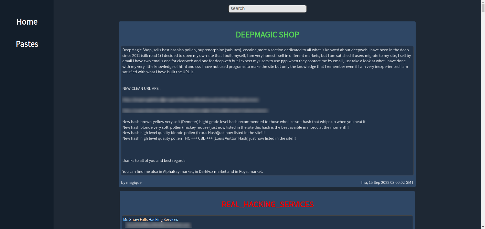

# Dark web paste scrapper
Dark web paste website scrapper I made in Intsights hackathon.



* The header of each paste in the client is colored based on the general sentiment of the paste: green = positive, red = negative and white = neutral.
# How to run?
- ```docker run -it -p 8118:8118 -p 9051:9051 -d dperson/torproxy``` to open the proxy.
- ```npm start``` from the root folder to open the server (port 4000).
- ```npm start``` from the client folder to open the client (port 3000).

# Server Requests
- ```/fetch``` to fetch the data to the database (while the docker is running)
- ```/fetchLoop``` & ```/stopFetchLoop``` to start and stop fetch loop (fetch data every 5m)
- ```/getPastes``` to get the pastes from the database.
- ```/cleanTable``` clear all pastes from the database.

